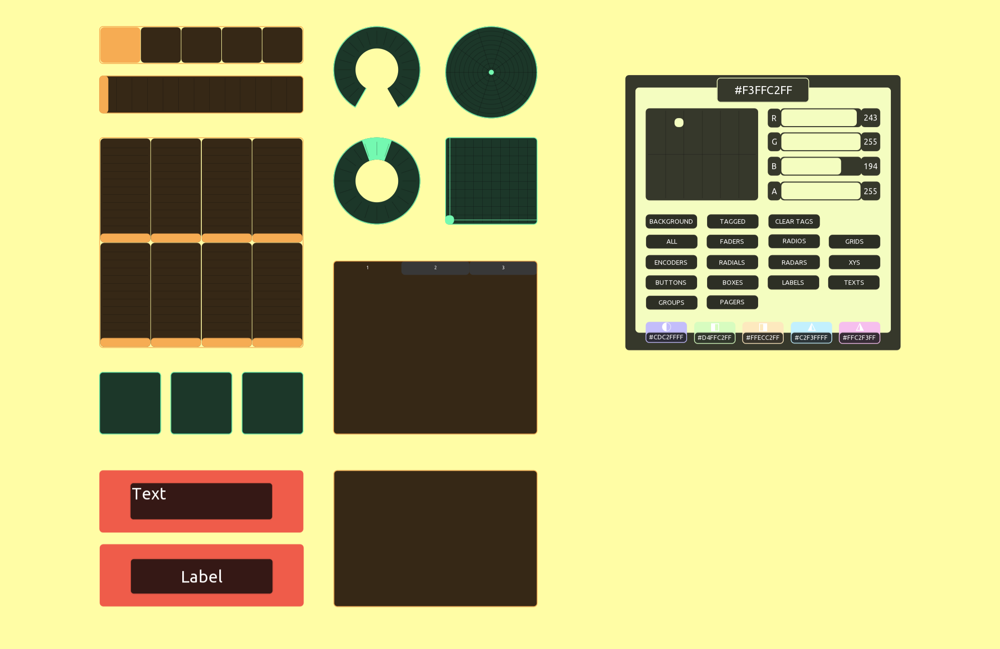
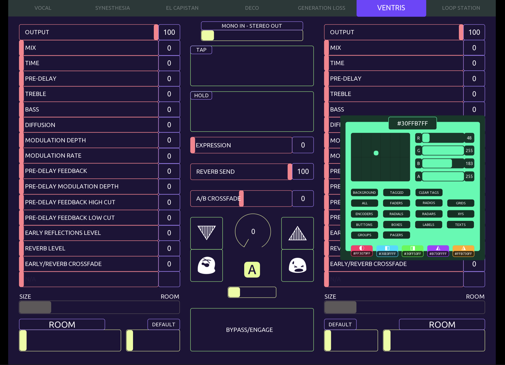

# Color Picker

This is a color picker which changes the color of the parent
background and children controls within the parent that it 
is placed. Toggle the buttons corresponding to the control 
colors you wish to change.

To change colors of specific controls, batch select all of 
them and tag with string 'color'. Press "clear tags" to 
remove tags.

The color picker also calculates helpful color combinations 
based on your chosen color.

Color combinations are:
Complementary, (2) Analogous, and (2)Triadic

Press any of the hex numbers to send that color to the 
controls you wish to change.

NOTES:

Arrange the color picker at the front of your document 
tree so it remains visible while making changes.

All controls should resize without issue, however you will 
need to adjust font size if you do.

This is a work in progress, so I plan on refactoring, making 
things more aesthetically functional, and adding features 
(saving favorite colors, more color combinations, changing 
text color, etc)

I took one semester of computer science a looong time 
ago, so please don’t judge my uncommented spaghetti 
code too harshly : )

I hope this helps you create harmonious color schemes 
more easily!
